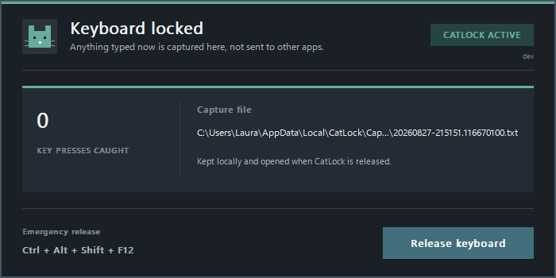

# CatLock

**A small keyboard lock for cats.**

CatLock temporarily intercepts keyboard input before it reaches your other apps. It is useful when a cat wants the keyboard but you do not want to close everything first.



## Download

Download the latest executable from [Releases](https://github.com/coalaura/catlock/releases):

- `catlock-windows-amd64.exe` for most Windows computers
- `catlock-windows-arm64.exe` for Windows on ARM

No installation is required.

## Usage

1. Run CatLock to lock the keyboard.
2. Let the paws take over.
3. Select **Release keyboard** or press `Ctrl + Alt + Shift + F12` when you are ready.

Key presses are saved only on your computer under `%LocalAppData%\CatLock\Captures`. The capture file opens automatically when CatLock is released.

## Build

CatLock requires Go 1.27 or newer.

```bash
go build -trimpath -o catlock.exe .
```
