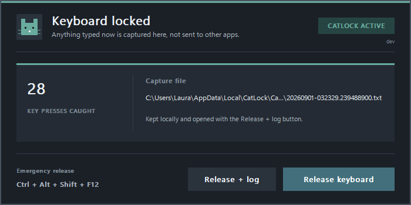

# CatLock

**A small keyboard lock for cats.**

CatLock temporarily intercepts keyboard input before it reaches your other apps. It is useful when a cat wants the keyboard but you do not want to close everything first.



## Download

Download the latest executable from [Releases](https://github.com/coalaura/catlock/releases):

- `catlock-windows-amd64.exe` for most Windows computers
- `catlock-windows-arm64.exe` for Windows on ARM
- `catlock-linux-amd64` for most Linux computers
- `catlock-linux-arm64` for Linux on ARM

No installation is required.

On Linux, CatLock supports native X11 sessions and Wayland desktops that honor **layer-shell exclusive keyboard focus** and provide **keyboard-shortcut inhibition**. The initial capability check detects the advertised protocols, but cannot verify that the compositor enforces exclusivity. KWin currently treats the exclusive request as ordinary focus eligibility, so clicking another application can end the lock on KDE Plasma. Standard GNOME Wayland sessions currently lack layer-shell and are reported as unsupported. CatLock never substitutes an XWayland grab for a Wayland keyboard lock.

The native Wayland backend uses the system's `libwayland-client.so.0` and `libxkbcommon.so.0`, normally included with a Wayland desktop. It needs no administrator permissions and makes no persistent changes to your input devices or desktop settings.

## Usage

1. Run CatLock to lock the keyboard.
2. Let the paws take over.
3. Select **Release keyboard** or press `Ctrl + Alt + Shift + F12` when you are ready. Select **Release + log** instead to also open the capture file.

Select the **−** button in the upper-right corner to switch to a compact window near the top-left of the screen, showing only the cat logo, key-press counter and **+** button. Select **+** to restore the regular centered window. The keyboard stays locked and key presses continue to be captured in either view; the emergency release shortcut also works in compact mode.

Key presses are saved only on your computer under `%LocalAppData%\CatLock\Captures` on Windows, or `$XDG_CACHE_HOME/CatLock/Captures` (normally `~/.cache/CatLock/Captures`) on Linux. The capture file is only opened when releasing through **Release + log**.

On Wayland, CatLock requests exclusive keyboard input and shows **Locking keyboard** until it receives keyboard focus and shortcut inhibition for every available keyboard seat. The focus event confirms current input delivery, not that focus cannot move elsewhere. If focus or inhibition is refused, lost or revoked, CatLock closes and releases the keyboard. Closing the process, including a crash, also releases its connection-scoped lock automatically. Desktop- or operating-system-reserved escape actions can still take precedence; CatLock is a convenience lock, not a security lock.

## Build

CatLock requires Go 1.27 or newer.

```powershell
go generate ./...
go build -trimpath -ldflags="-H=windowsgui" -o catlock.exe .
```

On Linux:

```sh
go build -trimpath -o catlock .
```

Linux builds do not require CGO. Wayland libraries are loaded at runtime through `purego`; the X11 backend does not need those libraries. The Wayland protocol tests use a private simulated compositor and never grab input from the running desktop.
